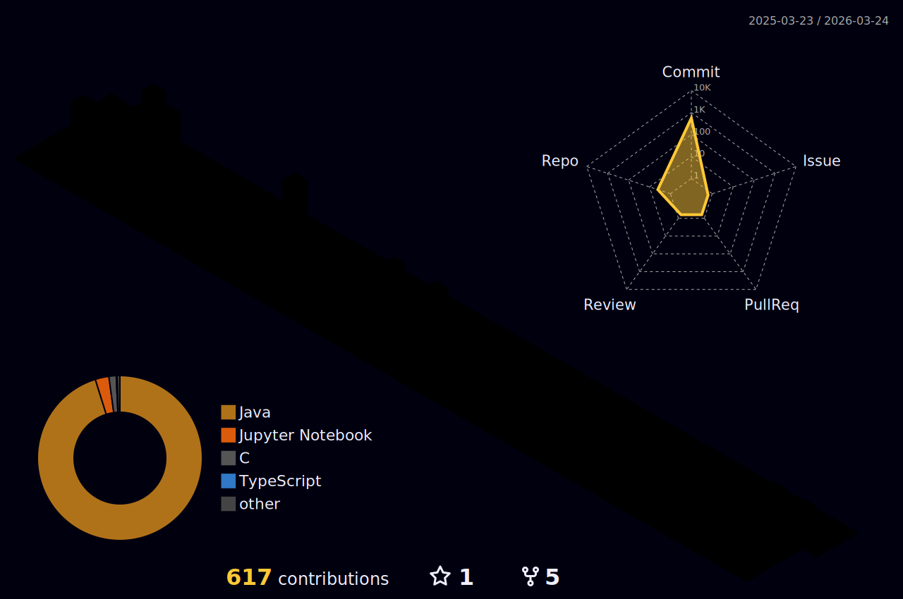

# Hello Folks

<h1 align="center"> I'm Parna Roy Chowdhury</h1>

- 📫 How to reach me **parnaroychowdhury2020@gmail.com**
   

# 💫 About Me:

<h4>
🔷Currently pursuing BTech in CSE from Techno Main Salt Lake 💻Tech Team Member at IIC TMSL 🗣️PR and Outreach Wing Member at IIC TMSL 🏆Tech Enthusiast 📈Aspiring SDE 
</h4>
 

## 🌐 Connect With Me:

 

## 💻 Tech Stack:

###

  
  
  
  
  
  
  
  
  
  
  
  
  
  
  
  
  
  
  
  

###

## 📊 GitHub Stats:

 
 

// ## 3D View of my Contributions:

// 
<h2 style="text-decoration: none; cursor: none;">📊 3D View of my Contributions:</h2>

// 

## 🏆 GitHub Trophies

## 🏅Badges

## 📈Activity Graph

### ✍️ Random Dev Quote

